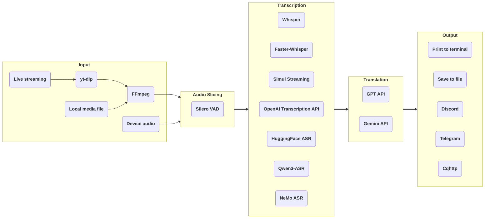

# stream-translator-gpt

[](https://badge.fury.io/py/stream-translator-gpt) [](https://pypi.org/project/stream-translator-gpt/) [](https://pepy.tech/project/stream-translator-gpt) [](https://github.com/ionic-bond/stream-translator-gpt/blob/main/LICENSE) [](https://gradio.app)

English | [中文](./README_CN.md) | [日本語](./README_JP.md)

stream-translator-gpt is a command-line tool for real-time transcription and translation of live streams. We have now added an easier-to-use WebUI entry point.

Try it on Colab: 

|                                                                                     WebUI                                                                                     |                                                                                       Command Line                                                                                        |
| :---------------------------------------------------------------------------------------------------------------------------------------------------------------------------: | :---------------------------------------------------------------------------------------------------------------------------------------------------------------------------------------: |
| [](https://colab.research.google.com/github/ionic-bond/stream-translator-gpt/blob/main/webui.ipynb) | [](https://colab.research.google.com/github/ionic-bond/stream-translator-gpt/blob/main/stream_translator.ipynb) |

(Due to frequent scraping and theft of API keys, we are unable to provide a trial API key. You need to fill in your own API key.)

## Pipeline



Uses [**yt-dlp**](https://github.com/yt-dlp/yt-dlp) to extract audio data from live streams.

Dynamic threshold audio slicing based on [**Silero-VAD**](https://github.com/snakers4/silero-vad).

Use [**Whisper**](https://github.com/openai/whisper) / [**Faster-Whisper**](https://github.com/SYSTRAN/faster-whisper) / [**Simul Streaming**](https://github.com/ufal/SimulStreaming) / [**HuggingFace ASR**](https://huggingface.co/models?pipeline_tag=automatic-speech-recognition) / [**Qwen3-ASR**](https://github.com/QwenLM/Qwen3-ASR) / [**NeMo ASR**](https://docs.nvidia.com/nemo-framework/user-guide/latest/nemotoolkit/asr/intro.html) locally or call [**OpenAI Transcription API**](https://platform.openai.com/docs/guides/speech-to-text) remotely for transcription.

Use OpenAI's [**GPT API**](https://platform.openai.com/docs/overview) / Google's [**Gemini API**](https://ai.google.dev/gemini-api/docs) for translation.

Finally, the results can be printed to the terminal, saved to a file, or sent to a group via social media bot.

## Prerequisites

1. **Python** >= 3.10
2. **FFmpeg** (skip if already installed):
   - Windows: `winget install ffmpeg`
   - Linux (Debian/Ubuntu): `sudo apt install ffmpeg`
3. [**Install CUDA on your system**](https://developer.nvidia.com/cuda-downloads).
4. [**Install cuDNN to your CUDA dir**](https://developer.nvidia.com/cudnn-downloads) if you want to use **Faster-Whisper**.
5. [**Install PyTorch (with CUDA) to your Python**](https://pytorch.org/get-started/locally/).
6. [**Create a Google API key**](https://aistudio.google.com/app/apikey) if you want to use **Gemini API** for translation.
7. [**Create a OpenAI API key**](https://platform.openai.com/api-keys) if you want to use **OpenAI Transcription API** for transcription or **GPT API** for translation.

## Installation

### uv Local Deployment

For a source checkout, you can use `uv` with Python 3.12.

Optional: source the local environment script first to keep virtualenvs, caches, downloaded models, and temporary files inside this project directory (`.venv`, `.cache`, `.local`, `.tmp`).

```bash
source scripts/use-local-env.sh
```

Command line only:

```bash
uv python install 3.12
uv sync
```

WebUI:

```bash
uv sync --extra webui
```

To include Qwen3-ASR:

```bash
# command line only
uv sync --extra qwen_asr

# WebUI
uv sync --extra webui --extra qwen_asr
```

To include NVIDIA NeMo ASR for Parakeet:

```bash
# command line only
uv sync --extra nemo_asr

# WebUI
uv sync --extra webui --extra nemo_asr
```

To include FireRedVAD via OmniVAD:

```bash
# command line only
uv sync --extra firered_vad

# WebUI
uv sync --extra webui --extra firered_vad
```

If you need CUDA, run `uv sync` first, then install or replace PyTorch with a build that matches your GPU/CUDA environment from the [PyTorch installation guide](https://pytorch.org/get-started/locally/). After installing a custom PyTorch build, run the virtualenv entry points directly, or use `uv run --no-sync ...`, so `uv` does not replace it during an exact sync.

For later dependency syncs after a custom PyTorch install, use the helper script to keep the current torch/triton/CUDA runtime in place:

```bash
scripts/uv-sync-preserve-torch.sh --extra webui --extra nemo_asr
```

Start the command line tool with:

```bash
stream-translator-gpt
# or
uv run --no-sync stream-translator-gpt
```

Start the WebUI with:

```bash
stream-translator-gpt-webui
# or
uv run --no-sync stream-translator-gpt-webui
```

### WebUI

```
pip install stream-translator-gpt[webui] -U
```

### Command Line

```
pip install stream-translator-gpt -U
```

## Usage

The commands on Colab [](https://colab.research.google.com/github/ionic-bond/stream-translator-gpt/blob/main/stream_translator.ipynb) are the recommended usage, below are some other commonly used options.

- Transcribe live streaming (default use **Whisper**):

    ```stream-translator-gpt {URL} --language {input_language}```

- Transcribe by **Faster-Whisper**:

    ```stream-translator-gpt {URL} --language {input_language} --use_faster_whisper```

- Transcribe by **SimulStreaming**:

    ```stream-translator-gpt {URL} --language {input_language} --use_simul_streaming```

- Transcribe by **SimulStreaming** with **Faster-Whisper** as the encoder:

    ```stream-translator-gpt {URL} --language {input_language} --use_simul_streaming --use_faster_whisper```

- Transcribe by **OpenAI Transcription API**:

    ```stream-translator-gpt {URL} --language {input_language} --use_openai_transcription_api --openai_api_key {your_openai_key}```

- Transcribe by a **HuggingFace ASR** model (requires `pip install stream-translator-gpt[hf_asr]`):

    ```stream-translator-gpt {URL} --model {hf_model_name} --use_hf_asr```

    Only models with `pipeline_tag: automatic-speech-recognition` on Hugging Face Hub are supported.

- Transcribe by **Qwen3-ASR** (requires `pip install stream-translator-gpt[qwen_asr]`):

    ```stream-translator-gpt {URL} --language {input_language} --use_qwen3_asr --qwen3_asr_model Qwen/Qwen3-ASR-0.6B```

    Use `--language auto` to let Qwen3-ASR detect the source language. Qwen3-ASR supports the 30 languages listed by the upstream project (for example `zh`, `en`, `ja`, `yue`, `fil`).
    The default `--qwen3_asr_device_map auto` requires a CUDA GPU supported by the installed PyTorch build; otherwise install a compatible PyTorch build or explicitly choose another device map.

- Transcribe Japanese with **NVIDIA Parakeet / NeMo ASR** (requires `pip install stream-translator-gpt[nemo_asr]`):

    ```stream-translator-gpt {URL} --language ja --use_nemo_asr --nemo_asr_model nvidia/parakeet-tdt_ctc-0.6b-ja```

    Parakeet is a NeMo-based Japanese ASR model, not a Transformers pipeline model. Use `--use_nemo_asr` instead of `--use_hf_asr`; TDT decoding is the default, and `--nemo_asr_decoding ctc` is available as a fallback/debug mode.
    When `--nemo_asr_device` is a CUDA device, the checkpoint is restored on CPU first and then moved to CUDA to reduce the temporary VRAM peak during model loading. Inference still runs on the selected CUDA device.

- Use **FireRedVAD** for audio slicing (requires `pip install stream-translator-gpt[firered_vad]`):

    ```stream-translator-gpt {URL} --vad_backend firered```

    FireRedVAD is provided through OmniVAD's CPU native runtime. It does not install or pin PyTorch, and uses the bundled OmniVAD FireRedVAD model unless `--firered_vad_model_path` is set.

### ASR model preloading

For repeated local ASR runs, add `--preload_asr_model` to load the selected ASR backend before starting the task. Add `--keep_asr_loaded` to keep the model resident after the first URL finishes; the CLI will prompt with `Next URL>`, and an empty line or `exit` unloads the model and exits.

```bash
stream-translator-gpt {URL} --language ja --use_nemo_asr --preload_asr_model --keep_asr_loaded
```

In persistent CLI mode, pressing Ctrl+C during a task stops only the current task and returns to `Next URL>`; pressing Ctrl+C at the prompt exits and unloads the model. If subtitle sharing is enabled together with `--keep_asr_loaded`, the sharing server stays on the same port and each new URL gets a fresh `task_id`.

In the WebUI Transcription tab, use `Preload ASR Model` and `Unload ASR Model`. Runs reuse the preloaded model only when the current ASR settings match; if backend/model/device/quantization or related ASR settings change, run is blocked until you preload again or unload. OpenAI Transcription API is remote and does not need preloading.

- Translate to other language by **Gemini**:

    ```stream-translator-gpt {URL} --language ja --translation_prompt "Translate from Japanese to Chinese" --google_api_key {your_google_key}```

- Translate to other language by **GPT**:

    ```stream-translator-gpt {URL} --language ja --translation_prompt "Translate from Japanese to Chinese" --openai_api_key {your_openai_key}```

- Using **OpenAI Transcription API** and **Gemini** at the same time:

    ```stream-translator-gpt {URL} --language ja --use_openai_transcription_api --openai_api_key {your_openai_key} --translation_prompt "Translate from Japanese to Chinese" --google_api_key {your_google_key}```

- Local video/audio file as input:

    ```stream-translator-gpt /path/to/file --language {input_language}```

- Record system audio as input:

    ```stream-translator-gpt device --language {input_language}```

- Record microphone as input:

    ```stream-translator-gpt device --language {input_language} --mic```

- Sending result to Discord:

    ```stream-translator-gpt {URL} --language {input_language} --discord_webhook_url {your_discord_webhook_url}```

- Sending result to Telegram:

    ```stream-translator-gpt {URL} --language {input_language} --telegram_token {your_telegram_token} --telegram_chat_id {your_telegram_chat_id}```

- Sending result to Cqhttp:

    ```stream-translator-gpt {URL} --language {input_language} --cqhttp_url {your_cqhttp_url} --cqhttp_token {your_cqhttp_token}```

- Saving result to a .srt subtitle file:

    ```stream-translator-gpt {URL} --language ja --translation_prompt "Translate from Japanese to Chinese" --google_api_key {your_google_key} --hide_transcribe_result --retry_if_translation_fails --output_timestamps --output_file_path ./result.srt```

### Subtitle sharing API

In the WebUI Output tab, enable `Enable Subtitle Sharing` and choose the public subtitle port, default `8765`.
For command-line runs, add `--enable_subtitle_sharing` to start the same SSE subtitle sharing server from the CLI process:

```bash
stream-translator-gpt {URL} --language {input_language} --enable_subtitle_sharing --subtitle_share_host 0.0.0.0 --subtitle_share_public_port 8765
```

The subtitle sharing server also serves a built-in live subtitle viewer at `http://127.0.0.1:8765/` and `http://127.0.0.1:8765/live_subtitles.html`.

External clients can then discover and consume the live subtitle stream with:

1. `GET /api/server/info` on the WebUI server, or on the CLI subtitle sharing port, to read `public_host`, `public_port`, and `enable_subtitle_sharing`.
2. `GET /api/translation/active-task` on the public subtitle port to read the current `task_id`.
3. `GET /api/translation/stream/{task_id}` on the public subtitle port to receive `text/event-stream` events.

The SSE stream emits `subtitle`, `status`, heartbeat comments, and `error` events. Subtitle data contains `timestamp`, `original`, `translated`, `asr_latency_ms`, and `llm_latency_ms`. `llm_latency_ms` is `null` when translation is disabled or has not run for that subtitle.

### All options

| Option                                  | Default Value                  | Description                                                                                                                                                                                                        |
| :-------------------------------------- | :----------------------------- | :----------------------------------------------------------------------------------------------------------------------------------------------------------------------------------------------------------------- |
| **Overall Options**                     |
| `--openai_api_key`                      |                                | OpenAI API key if using GPT translation / Whisper API. If you have multiple keys, you can separate them with "," and each key will be used in turn.                                                                |
| `--google_api_key`                      |                                | Google API key if using Gemini translation. If you have multiple keys, you can separate them with "," and each key will be used in turn.                                                                           |
| `--openai_base_url`                     |                                | Customize the API endpoint of OpenAI (Affects GPT translation & OpenAI Transcription).                                                                                                                             |
| `--google_base_url`                     |                                | Customize the API endpoint of Google (Affects Gemini translation).                                                                                                                                                 |
| `--proxy`                               |                                | Used to set the proxy for all --*_proxy flags if they are not specifically set. Also sets http_proxy environment variables.                                                                                        |
| **Input Options**                       |
| `URL`                                   |                                | The URL of the stream. If a local file path is filled in, it will be used as input. If fill in "device", the input will be obtained from your PC device.                                                           |
| `--format`                              | ba/wa*                         | Stream format code, this parameter will be passed directly to yt-dlp. You can get the list of available format codes by `yt-dlp {url} -F`                                                                          |
| `--list_format`                         |                                | Print all available formats then exit.                                                                                                                                                                             |
| `--cookies`                             |                                | Used to open member-only stream, this parameter will be passed directly to yt-dlp.                                                                                                                                 |
| `--input_proxy`                         |                                | Use the specified HTTP/HTTPS/SOCKS proxy for yt-dlp, e.g. http://127.0.0.1:7890.                                                                                                                                   |
| `--device_index`                        |                                | The index of the device that needs to be recorded. If not set, the system default recording device will be used.                                                                                                   |
| `--list_devices`                        |                                | Print all audio devices info then exit.                                                                                                                                                                            |
| `--device_recording_interval`           | 0.5                            | The shorter the recording interval, the lower the latency, but it will increase CPU usage. It is recommended to set it between 0.1 and 1.0.                                                                        |
| **Audio Slicing Options**               |
| `--min_audio_length`                    | 0.5                            | Minimum slice audio length in seconds.                                                                                                                                                                             |
| `--max_audio_length`                    | 30.0                           | Maximum slice audio length in seconds.                                                                                                                                                                             |
| `--target_audio_length`                 | 5.0                            | When dynamic no speech threshold is enabled (enabled by default), the program will slice the audio as close to this length as possible.                                                                            |
| `--continuous_no_speech_threshold`      | 1.0                            | Slice if there is no speech during this number of seconds. If the dynamic no speech threshold is enabled (enabled by default), the actual threshold will be dynamically adjusted based on this value.              |
| `--disable_dynamic_no_speech_threshold` |                                | Set this flag to disable dynamic no speech threshold.                                                                                                                                                              |
| `--prefix_retention_length`             | 0.5                            | The length of the retention prefix audio during slicing.                                                                                                                                                           |
| `--vad_backend`                         | silero                         | VAD backend used for audio slicing: silero or firered. FireRedVAD requires `pip install stream-translator-gpt[firered_vad]`.                                                                                      |
| `--firered_vad_model_path`              |                                | Optional OmniVAD FireRedVAD `.omnivad` model path. If omitted, the bundled OmniVAD model is used.                                                                                                                 |
| `--vad_threshold`                       | 0.35                           | Range 0~1. the higher this value, the stricter the speech judgment. If dynamic VAD threshold is enabled (enabled by default), this threshold will be adjusted dynamically based on the input speech's VAD results. |
| `--disable_dynamic_vad_threshold`       |                                | Set this flag to disable dynamic VAD threshold.                                                                                                                                                                    |
| **Transcription Options**               |
| `--model`                               | small                          | Select Whisper/Faster-Whisper/Simul Streaming model size. See [here](https://github.com/openai/whisper#available-models-and-languages) for available models.                                                       |
| `--language`                            | auto                           | Language spoken in the stream. See [here](https://github.com/openai/whisper#available-models-and-languages) for available languages.                                                                               |
| `--use_faster_whisper`                  |                                | Set this flag to use Faster-Whisper instead of Whisper. If used with --use_simul_streaming, SimulStreaming with Faster-Whisper as the encoder will be used.                                                        |
| `--use_simul_streaming`                 |                                | Set this flag to use SimulStreaming instead of Whisper. If used with --use_faster_whisper, SimulStreaming with Faster-Whisper as the encoder will be used.                                                         |
| `--use_openai_transcription_api`        |                                | Set this flag to use OpenAI transcription API instead of the original local Whipser.                                                                                                                               |
| `--use_hf_asr`                          |                                | Set this flag to use a HuggingFace ASR model. Use `--model` to specify the model ID. Requires `pip install stream-translator-gpt[hf_asr]`.                                                                         |
| `--use_qwen3_asr`                       |                                | Set this flag to use Qwen3-ASR. Requires `pip install stream-translator-gpt[qwen_asr]`.                                                                                                                            |
| `--qwen3_asr_model`                     | Qwen/Qwen3-ASR-0.6B            | Qwen3-ASR model name, e.g. Qwen/Qwen3-ASR-0.6B or Qwen/Qwen3-ASR-1.7B.                                                                                                                                             |
| `--qwen3_asr_dtype`                     | bfloat16                       | Torch dtype used when loading Qwen3-ASR, e.g. bfloat16, float16, float32.                                                                                                                                          |
| `--qwen3_asr_device_map`                | auto                           | Device map used when loading Qwen3-ASR, e.g. auto, cuda:0, cpu. The selected CUDA device must be supported by the installed PyTorch build.                                                                         |
| `--qwen3_asr_max_new_tokens`            | 512                            | Maximum number of generated tokens for Qwen3-ASR.                                                                                                                                                                  |
| `--qwen3_asr_quantization`              | none                           | Qwen3-ASR quantization mode: none, bnb_8bit, or bnb_4bit. Requires bitsandbytes from the `qwen_asr` extra.                                                                                                        |
| `--qwen3_asr_bnb_4bit_quant_type`       | nf4                            | BitsAndBytes 4-bit quantization type for Qwen3-ASR: nf4 or fp4.                                                                                                                                                   |
| `--qwen3_asr_bnb_4bit_use_double_quant` |                                | Enable nested/double quantization for Qwen3-ASR 4-bit loading.                                                                                                                                                    |
| `--use_nemo_asr`                        |                                | Set this flag to use NVIDIA NeMo ASR. Requires `pip install stream-translator-gpt[nemo_asr]`.                                                                                                                     |
| `--nemo_asr_model`                      | nvidia/parakeet-tdt_ctc-0.6b-ja | NeMo ASR model name. The default Parakeet model is Japanese-focused and uses NeMo, not the Transformers `--use_hf_asr` backend.                                                                                   |
| `--nemo_asr_device`                     | auto                           | Device used when running NeMo ASR, e.g. auto, cuda:0, cuda:1, cpu, or another device string accepted by PyTorch.                                                                                                  |
| `--nemo_asr_decoding`                   | tdt                            | Decoding mode for hybrid NeMo ASR models: tdt or ctc. TDT keeps the model default decoder and is recommended for short near-real-time slices.                                                                      |
| `--transcription_filters`               | emoji_filter,repetition_filter | Filters apply to transcription results, separated by ",". We provide emoji_filter, repetition_filter and japanese_stream_filter.                                                                                   |
| `--transcription_initial_prompt`        |                                | General purpose prompt/glossary for transcription. Format: "Word1, Word2, Word3, ...". This text is always included in the prompt passed to the model.                                                             |
| `--disable_transcription_context`       |                                | Set this flag to disable context (previous sentence) propagation in transcription.                                                                                                                                 |
| `--preload_asr_model`                   |                                | Preload the selected local ASR backend before running. OpenAI Transcription API is remote and does not need preloading.                                                                                            |
| `--keep_asr_loaded`                     |                                | Keep the preloaded ASR model resident after each task and prompt for the next URL. Requires `--preload_asr_model`.                                                                                                  |
| **Translation Options**                 |
| `--gpt_model`                           | gpt-5.4-nano                   | OpenAI's GPT model name, gpt-5.4 / gpt-5.4-mini / gpt-5.4-nano / gpt-5.5                                                                                                                                           |
| `--gemini_model`                        | gemini-3.1-flash-lite          | Google's Gemini model name, gemini-2.5-flash / gemini-2.5-flash-lite / gemini-3-flash-preview / gemini-3.1-flash-lite / gemini-3.5-flash                                                                           |
| `--translation_prompt`                  |                                | If set, will translate the result text to target language via GPT / Gemini API (According to which API key is filled in). Example: "Translate from Japanese to Chinese"                                            |
| `--translation_history_size`            | 0                              | The number of previous transcripts sent as context when calling the LLM API. It is recommended to disable context (set to 0) for weaker models.                                                                    |
| `--translation_timeout`                 | 10                             | If the GPT / Gemini translation exceeds this number of seconds, the translation will be discarded.                                                                                                                 |
| `--use_json_result`                     |                                | Using JSON result in LLM translation for some locally deployed models.                                                                                                                                             |
| `--retry_if_translation_fails`          |                                | Retry when translation times out/fails. Used to generate subtitles offline.                                                                                                                                        |
| `--temperature`                         |                                | GPT/Gemini parameter. Controls output randomness, higher values produce more diverse results.                                                                                                                      |
| `--top_p`                               |                                | GPT/Gemini parameter. Nucleus sampling threshold, only tokens with cumulative probability above this value are considered.                                                                                         |
| `--top_k`                               |                                | Gemini parameter. Limits token selection to the top K most probable candidates.                                                                                                                                    |
| `--prompt_cache_key`                    |                                | GPT parameter. If set, enables prompt caching optimization on the API side.                                                                                                                                        |
| `--reasoning_effort`                    |                                | GPT parameter. Controls reasoning depth for reasoning models. Options: none / minimal / low / medium / high / xhigh.                                                                                               |
| `--verbosity`                           |                                | GPT parameter. Controls the verbosity of the response. Options: auto / short / concise / detailed.                                                                                                                 |
| `--service_tier`                        |                                | GPT parameter. Specifies processing priority tier. Options: auto / default / flex / priority.                                                                                                                      |
| `--debug_mode`                          |                                | Enable debug mode. Print messages sent to LLM and usage info after each translation call.                                                                                                                          |
| `--processing_proxy`                    |                                | Use the specified HTTP/HTTPS/SOCKS proxy for Whisper/GPT API (Gemini currently doesn't support specifying a proxy within the program), e.g. http://127.0.0.1:7890.                                                 |
| **Output Options**                      |
| `--output_timestamps`                   |                                | Output the timestamp of the text when outputting the text.                                                                                                                                                         |
| `--show_latency_log`                    |                                | Print ASR and LLM latency in milliseconds in terminal logs.                                                                                                                                                        |
| `--hide_transcribe_result`              |                                | Hide the result of Whisper transcribe.                                                                                                                                                                             |
| `--output_file_path`                    |                                | If set, will save the result text to this path.                                                                                                                                                                    |
| `--cqhttp_url`                          |                                | If set, will send the result text to the cqhttp server.                                                                                                                                                            |
| `--cqhttp_token`                        |                                | Token of cqhttp, if it is not set on the server side, it does not need to fill in.                                                                                                                                 |
| `--discord_webhook_url`                 |                                | If set, will send the result text to the discord channel.                                                                                                                                                          |
| `--telegram_token`                      |                                | Token of Telegram bot.                                                                                                                                                                                             |
| `--telegram_chat_id`                    |                                | If set, will send the result text to this Telegram chat. Needs to be used with \"--telegram_token\".                                                                                                               |
| `--output_proxy`                        |                                | Use the specified HTTP/HTTPS/SOCKS proxy for Cqhttp/Discord/Telegram, e.g. http://127.0.0.1:7890.                                                                                                                  |
| `--enable_subtitle_sharing`             |                                | Start a public SSE subtitle sharing server from the CLI process.                                                                                                                                                    |
| `--subtitle_share_host`                 | 0.0.0.0                        | Host/IP to bind the subtitle sharing server. Use 0.0.0.0 to listen on all interfaces.                                                                                                                               |
| `--subtitle_share_public_port`          | 8765                           | Public subtitle sharing port used with `--enable_subtitle_sharing`.                                                                                                                                                 |

## Contact me

Telegram: [@ionic_bond](https://t.me/ionic_bond)

## Donate

[PayPal Donate](https://www.paypal.com/donate/?hosted_button_id=D5DRBK9BL6DUA) or [PayPal](https://paypal.me/ionicbond3)
