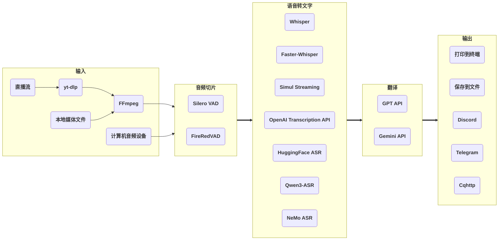

# stream-translator-gpt

[](./LICENSE) [](https://gradio.app)

[English](./README.md) | 中文 | [日本語](./README_JP.md)

stream-translator-gpt 是一个用于实时转录和翻译直播流的命令行工具。我们新增了更易于使用的 WebUI 入口。

本仓库是原项目 [ionic-bond/stream-translator-gpt](https://github.com/ionic-bond/stream-translator-gpt) 的 fork。

在 Colab 上尝试：

|                                                                                     WebUI                                                                                     |                                                                                          命令行                                                                                           |
| :---------------------------------------------------------------------------------------------------------------------------------------------------------------------------: | :---------------------------------------------------------------------------------------------------------------------------------------------------------------------------------------: |
| [](https://colab.research.google.com/github/W-Nana/stream-translator-gpt/blob/main/webui.ipynb) | [](https://colab.research.google.com/github/W-Nana/stream-translator-gpt/blob/main/stream_translator.ipynb) |

（由于 API key 被频繁爬取和盗用，我们无法提供用于试用的 API key。您需要填写自己的 API key。）

## 工作流



使用 [**yt-dlp**](https://github.com/yt-dlp/yt-dlp) 从直播流中提取音频数据。

动态阈值音频切片可以使用 [**Silero-VAD**](https://github.com/snakers4/silero-vad)，也可以通过 OmniVAD 使用 **FireRedVAD**。

在本地使用 [**Whisper**](https://github.com/openai/whisper) / [**Faster-Whisper**](https://github.com/SYSTRAN/faster-whisper) / [**Simul Streaming**](https://github.com/ufal/SimulStreaming) / [**HuggingFace ASR**](https://huggingface.co/models?pipeline_tag=automatic-speech-recognition) / [**Qwen3-ASR**](https://github.com/QwenLM/Qwen3-ASR) / [**NeMo ASR**](https://docs.nvidia.com/nemo-framework/user-guide/latest/nemotoolkit/asr/intro.html) 或远程调用 [**OpenAI Transcription API**](https://platform.openai.com/docs/guides/speech-to-text) 进行转录。

使用 OpenAI 的 [**GPT API**](https://platform.openai.com/docs/overview) / Google 的 [**Gemini API**](https://ai.google.dev/gemini-api/docs) 进行翻译。

最后，结果可以打印到终端、保存到文件，或通过社交媒体机器人发送到群组。

## 项目结构

```text
.
├── stream_translator_gpt/        # 核心 CLI pipeline、ASR 后端、VAD、翻译、字幕共享
│   ├── assets/live_subtitles.html
│   └── simul_streaming/          # 内置 SimulStreaming / Whisper streaming 组件
├── webui/                        # Gradio WebUI、默认设置和多语言文件
│   ├── default.json
│   └── locales/
├── scripts/                      # 桌面/源码树运行用的本地 uv 环境辅助脚本
├── requirements*.txt             # 可选依赖组的兼容 requirements 文件
├── stream_translator.ipynb       # Colab 命令行 notebook
├── webui.ipynb                   # Colab WebUI notebook
├── pyproject.toml                # 包元数据、uv 依赖/extras、命令入口
└── uv.lock                       # uv 锁定依赖解析结果
```

生成的本地运行目录 `.venv`、`.cache`、`.local`、`.tmp`、`.config` 会被忽略，不应提交到仓库。

## 准备工作

1. **Python** >= 3.10
2. **FFmpeg**（如果您的系统已安装 FFmpeg 可跳过此步）：
   - Windows: `winget install ffmpeg`
   - Linux (Debian/Ubuntu): `sudo apt install ffmpeg`
3. [**在您的系统上安装 CUDA**](https://developer.nvidia.com/cuda-downloads)。
4. 如果您想使用 **Faster-Whisper**，[**请将 cuDNN 安装到您的 CUDA 目录**](https://developer.nvidia.com/cudnn-downloads)。
5. [**为您的 Python 安装 PyTorch (CUDA 版本)**](https://pytorch.org/get-started/locally/)。
6. 如果您想使用 **Gemini API** 进行翻译，[**请创建一个 Google API 密钥**](https://aistudio.google.com/app/apikey)。
7. 如果您想使用 **OpenAI Transcription API** 进行语音转文字或使用 **GPT API** 进行翻译，[**请创建一个 OpenAI API 密钥**](https://platform.openai.com/api-keys)。

## 安装

### uv 本地部署

推荐在源码目录中使用 `uv` 和 Python 3.12 运行本项目。

1. 可选：让虚拟环境、uv 缓存、模型下载和临时文件都留在项目目录内。

    ```bash
    source scripts/use-local-env.sh
    ```

    该脚本会设置 `.venv`、`.cache`、`.local`、`.tmp` 等项目内路径。

2. 使用 uv 安装 Python 3.12，然后同步基础环境。

    ```bash
    uv python install 3.12
    uv sync
    ```

3. 按需要添加 extra。每个功能使用一个 `--extra`，可以自由组合。

    | Extra | 功能 |
    | :---- | :--- |
    | `webui` | Gradio WebUI |
    | `hf_asr` | HuggingFace ASR 后端 |
    | `qwen_asr` | Qwen3-ASR 后端和 BitsAndBytes 量化支持 |
    | `nemo_asr` | NVIDIA NeMo ASR 后端，包括 Parakeet |
    | `firered_vad` | 通过 OmniVAD 使用 FireRedVAD |

    只使用命令行并启用 Qwen3-ASR：

    ```bash
    uv sync --extra qwen_asr
    ```

    安装所有 extras：

    ```bash
    uv sync --extra webui --extra hf_asr --extra qwen_asr --extra nemo_asr --extra firered_vad
    ```

4. 如果需要自定义 CUDA/PyTorch build，请先完成 `uv sync`，再根据显卡/CUDA 环境，从 [PyTorch 安装指南](https://pytorch.org/get-started/locally/) 安装或替换合适的 PyTorch build。

    安装自定义 PyTorch 后，运行时请使用 `uv run --no-sync ...`，或直接调用 `.venv/bin/...`。以后需要再次同步依赖时，可以使用辅助脚本，让 uv 保留当前 torch/triton/CUDA runtime 包：

    ```bash
    scripts/uv-sync-preserve-torch.sh --extra webui --extra nemo_asr
    ```

5. 启动命令行工具或 WebUI。

    ```bash
    uv run --no-sync stream-translator-gpt {网址}
    uv run --no-sync stream-translator-gpt-webui
    ```

    如果已经执行过 `source scripts/use-local-env.sh`，虚拟环境会在 `PATH` 中，也可以直接运行：

    ```bash
    stream-translator-gpt {网址}
    stream-translator-gpt-webui
    ```

## 使用方法

Colab上的命令 [](https://colab.research.google.com/github/W-Nana/stream-translator-gpt/blob/main/stream_translator.ipynb) 即为推荐的使用方式，以下是一些其他常用选项。

- 转录直播流 (默认使用 **Whisper**):

    ```stream-translator-gpt {网址} --language {输入语言}```

- 使用 **Faster-Whisper** 进行转录:

    ```stream-translator-gpt {网址} --language {输入语言} --use_faster_whisper```

- 使用 **SimulStreaming** 进行转录:

    ```stream-translator-gpt {网址} --language {输入语言} --use_simul_streaming```

- 使用以 **Faster-Whisper** 作为编码器的 **SimulStreaming** 进行转录:

    ```stream-translator-gpt {网址} --language {输入语言} --use_simul_streaming --use_faster_whisper```

- 使用 **OpenAI Transcription API** 进行转录:

    ```stream-translator-gpt {网址} --language {输入语言} --use_openai_transcription_api --openai_api_key {您的 OpenAI 密钥}```

- 使用 **HuggingFace ASR** 模型进行转录（需要同步 `--extra hf_asr`）：

    ```stream-translator-gpt {网址} --model {hf_model_name} --use_hf_asr```

    仅支持在 Hugging Face Hub 上 `pipeline_tag` 为 `automatic-speech-recognition` 的模型。

- 使用 **Qwen3-ASR** 进行转录（需要同步 `--extra qwen_asr`）：

    ```stream-translator-gpt {网址} --language {输入语言} --use_qwen3_asr --qwen3_asr_model Qwen/Qwen3-ASR-0.6B```

    使用 `--language auto` 可让 Qwen3-ASR 自动识别源语言。Qwen3-ASR 支持上游项目列出的 30 种语言（例如 `zh`、`en`、`ja`、`yue`、`fil`）。
    默认的 `--qwen3_asr_device_map auto` 需要当前 PyTorch 支持所选 CUDA 显卡；否则请安装兼容的 PyTorch，或显式选择其他 device map。

- 使用 **NVIDIA Parakeet / NeMo ASR** 转录日语（需要同步 `--extra nemo_asr`）：

    ```stream-translator-gpt {网址} --language ja --use_nemo_asr --nemo_asr_model nvidia/parakeet-tdt_ctc-0.6b-ja```

    Parakeet 是基于 NeMo 的日语 ASR 模型，不是 Transformers pipeline 模型。请使用 `--use_nemo_asr`，不要使用 `--use_hf_asr`；TDT 解码是默认模式，也可以用 `--nemo_asr_decoding ctc` 作为 fallback/debug 模式。
    当 `--nemo_asr_device` 是 CUDA 设备时，checkpoint 会先在 CPU 上还原，再移动到 CUDA，以降低模型加载阶段的临时显存峰值。推理仍会在所选 CUDA 设备上运行。

- 使用 **FireRedVAD** 进行音频切片（需要同步 `--extra firered_vad`）：

    ```stream-translator-gpt {网址} --vad_backend firered```

    FireRedVAD 通过 OmniVAD 的 CPU native runtime 提供。默认使用 OmniVAD 内置的 FireRedVAD 模型，也可以通过 `--firered_vad_model_path` 指定自定义模型。

### ASR 模型预载

如果需要连续运行本地 ASR，可以添加 `--preload_asr_model`，先加载当前选择的 ASR 后端再开始任务。再加 `--keep_asr_loaded` 时，第一个 URL 结束后模型会继续常驻，CLI 会显示 `Next URL>`；输入新的 URL 可继续运行，空行或 `exit` 会卸载模型并退出。

```bash
stream-translator-gpt {网址} --language ja --use_nemo_asr --preload_asr_model --keep_asr_loaded
```

CLI 常驻模式下，任务执行中按 Ctrl+C 只会停止当前任务并回到 `Next URL>`；在提示符状态按 Ctrl+C 会退出并卸载模型。如果同时开启 `--enable_subtitle_sharing` 和 `--keep_asr_loaded`，字幕共享服务器会保持同一个端口常驻，每个新 URL 会生成新的 `task_id`。

WebUI 的「语音转文字」页提供 `Preload ASR Model` 和 `Unload ASR Model`。只有当前 ASR 设置与已预载模型匹配时才会复用；如果 backend/model/device/quantization 或相关 ASR 设置改变，运行会被阻止，需重新预载或卸载。OpenAI Transcription API 是远端服务，不需要预载。

- 使用 **Gemini** 翻译成其他语言:

    ```stream-translator-gpt {网址} --language ja --translation_prompt "翻译以下日语为中文，只输出译文，不要输出原文，在一行内输出" --google_api_key {您的 Google 密钥}```

- 使用 **GPT** 翻译成其他语言:

    ```stream-translator-gpt {网址} --language ja --translation_prompt "翻译以下日语为中文，只输出译文，不要输出原文，在一行内输出" --openai_api_key {您的 OpenAI 密钥}```

- 同时使用 **OpenAI Transcription API** 和 **Gemini**:

    ```stream-translator-gpt {网址} --language ja --use_openai_transcription_api --openai_api_key {您的 OpenAI 密钥} --translation_prompt "翻译以下日语为中文，只输出译文，不要输出原文，在一行内输出" --google_api_key {您的 Google 密钥}```

- 使用本地视频/音频文件作为输入:

    ```stream-translator-gpt {文件路径} --language {输入语言}```

- 录制系统声音作为输入:

    ```stream-translator-gpt device --language {输入语言}```

- 录制麦克风作为输入:

    ```stream-translator-gpt device --language {输入语言} --mic```

- 发送结果到 Discord:

    ```stream-translator-gpt {网址} --language {输入语言} --discord_webhook_url {您的_discord_webhook_网址}```

- 发送结果到 Telegram:

    ```stream-translator-gpt {网址} --language {输入语言} --telegram_token {您的 Telegram 令牌} --telegram_chat_id {您的 Telegram 聊天 id}```

- 发送结果到 Cqhttp:

    ```stream-translator-gpt {网址} --language {输入语言} --cqhttp_url {您的 cqhttp 地址} --cqhttp_token {您的 cqhttp 令牌}```

- 保存结果到 .srt 字幕文件:

    ```stream-translator-gpt {网址} --language ja --translation_prompt "翻译以下日语为中文，只输出译文，不要输出原文，在一行内输出" --google_api_key {您的 Google 密钥} --hide_transcribe_result --retry_if_translation_fails --output_timestamps --output_file_path ./result.srt```

### 字幕共享 API

在 WebUI 的「输出」页中开启「开启字幕共享」，并设置公开字幕端口，默认值为 `8765`。
命令行运行时，可添加 `--enable_subtitle_sharing`，由 CLI 进程启动同一个 SSE 字幕共享服务器：

```bash
stream-translator-gpt {网址} --language {输入语言} --enable_subtitle_sharing --subtitle_share_host 0.0.0.0 --subtitle_share_public_port 8765
```

字幕共享服务器也会内置一个实时字幕查看页，可通过 `http://127.0.0.1:8765/` 或 `http://127.0.0.1:8765/live_subtitles.html` 打开。

也可以配合 [W-Nana/SubtitleOverlay](https://github.com/W-Nana/SubtitleOverlay) 显示共享字幕。先在本项目开启字幕共享，然后在 SubtitleOverlay 中将翻译服务器地址设置为公开字幕服务器地址；同机可填 `http://127.0.0.1:8765`，局域网内其他设备可填 `http://192.168.1.100:8765` 这类实际主机地址。

WebUI 的命令日志会在显示前遮蔽 API Key、机器人 Token、Webhook URL 和带账号密码的代理地址。字幕共享开启后读取端点是公开的；如果绑定到 `0.0.0.0`，局域网内其他设备可以读取当前字幕。

外部客户端可按以下顺序发现并消费实时字幕流：

1. 在 WebUI 服务器，或 CLI 字幕共享端口请求 `GET /api/server/info`，读取 `public_host`、`public_port` 和 `enable_subtitle_sharing`。
2. 在公开字幕端口请求 `GET /api/translation/active-task`，读取当前 `task_id`。
3. 在公开字幕端口请求 `GET /api/translation/stream/{task_id}`，以 `text/event-stream` 接收 SSE。

SSE 会发送 `subtitle`、`status`、心跳注释和 `error` 事件。字幕数据包含 `timestamp`、`original`、`translated`、`asr_latency_ms`、`llm_latency_ms`。未启用翻译或该字幕未执行翻译时，`llm_latency_ms` 为 `null`。

### 所有选项

| 选项                                    | 默认值                         | 描述                                                                                                                                                                      |
| :-------------------------------------- | :----------------------------- | :------------------------------------------------------------------------------------------------------------------------------------------------------------------------ |
| **通用选项**                            |
| `--openai_api_key`                      |                                | 如果使用 GPT 翻译 / Whisper API，则需要 OpenAI API 密钥。如果您有多个密钥，可以用 "," 分隔，每个密钥将轮流使用。                                                          |
| `--google_api_key`                      |                                | 如果使用 Gemini 翻译，则需要 Google API 密钥。如果您有多个密钥，可以用 "," 分隔，每个密钥将轮流使用。                                                                     |
| `--openai_base_url`                     |                                | 自定义 OpenAI 的 API 端点 (影响 GPT 翻译和 OpenAI Whisper 转录)。                                                                                                         |
| `--google_base_url`                     |                                | 自定义 Google 的 API 端点 (影响 Gemini 翻译)。                                                                                                                            |
| `--proxy`                               |                                | 用于设置所有未特别指定的 --*_proxy 的值。也会设置 http_proxy 等环境变量。                                                                                                 |
| `--insecure_api_tls`                    |                                | 禁用 API 客户端和模型下载的 TLS 证书验证。仅应在可信调试代理或受控网络中使用。                                                                                            |
| **输入选项**                            |                                |                                                                                                                                                                           |
| `URL`                                   |                                | 直播流的 URL。如果填入本地文件路径，则会将其用作输入。如果填入 "device"，将从您的 PC 设备获取输入。                                                                       |
| `--format`                              | ba/wa*                         | 码流格式代码，此参数将直接传递给 yt-dlp。您可以通过 `yt-dlp {url} -F` 获取可用格式代码的列表。                                                                            |
| `--list_format`                         |                                | 打印所有可用格式然后退出。                                                                                                                                                |
| `--cookies`                             |                                | 用于打开会员专属直播，此参数将直接传递给 yt-dlp。                                                                                                                         |
| `--input_proxy`                         |                                | 为 yt-dlp 使用指定的 HTTP/HTTPS/SOCKS 代理，例如 http://127.0.0.1:7890。                                                                                                  |
| `--device_index`                        |                                | 需要录制的设备的索引。如果未设置，将使用系统默认的录音设备。                                                                                                              |
| `--list_devices`                        |                                | 打印所有音频设备信息然后退出。                                                                                                                                            |
| `--device_recording_interval`           | 0.5                            | 录制间隔越短，延迟越低，但会增加 CPU 使用率。建议设置在 0.1 和 1.0 之间。                                                                                                 |
| **音频切片选项**                        |                                |                                                                                                                                                                           |
| `--min_audio_length`                    | 0.5                            | 最小音频切片长度（秒）。                                                                                                                                                  |
| `--max_audio_length`                    | 30.0                           | 最大音频切片长度（秒）。                                                                                                                                                  |
| `--target_audio_length`                 | 5.0                            | 当启用动态无语音阈值时（默认启用），程序将尽可能按接近此长度切割音频。                                                                                                    |
| `--continuous_no_speech_threshold`      | 1.0                            | 如果在此秒数内没有语音，则进行切片。如果启用了动态无语音阈值（默认启用），实际阈值将基于此值动态调整。                                                                    |
| `--disable_dynamic_no_speech_threshold` |                                | 设置此标志以禁用动态静音阈值。                                                                                                                                            |
| `--prefix_retention_length`             | 0.5                            | 切片时保留的前缀音频长度。                                                                                                                                                |
| `--vad_backend`                         | silero                         | 音频切片使用的 VAD 后端：silero 或 firered。FireRedVAD 需要 `firered_vad` extra。                                                                                           |
| `--firered_vad_model_path`              |                                | 可选的 OmniVAD FireRedVAD `.omnivad` 模型路径。留空时使用 OmniVAD 内置模型。                                                                                              |
| `--vad_threshold`                       | 0.35                           | 范围 0~1。此值越高，语音判断越严格。如果启用了动态 VAD 阈值（默认启用），此阈值将根据输入语音的 VAD 结果动态调整。                                                        |
| `--disable_dynamic_vad_threshold`       |                                | 设置此标志以禁用动态 VAD 阈值。                                                                                                                                           |
| **转录选项**                            |                                |                                                                                                                                                                           |
| `--model`                               | small                          | 选择 Whisper/Faster-Whisper/Simul Streaming 模型大小。可用模型请参见 [此处](https://github.com/openai/whisper#available-models-and-languages)。                           |
| `--language`                            | auto                           | 直播流中的语言。可用语言请参见 [此处](https://github.com/openai/whisper#available-models-and-languages)。                                                                 |
| `--use_faster_whisper`                  |                                | 设置此标志以使用 Faster-Whisper 进行语音转文字，而不是原始的 OpenAI Whisper。如果与 --use_simul_streaming 一起使用，将使用以 Faster-Whisper 作为编码器的 SimulStreaming。 |
| `--use_simul_streaming`                 |                                | 设置此标志以使用 SimulStreaming 进行语音转文字，而不是原始的 OpenAI Whisper。如果与 --use_faster_whisper 一起使用，将使用以 Faster-Whisper 作为编码器的 SimulStreaming。  |
| `--use_openai_transcription_api`        |                                | 设置此标志以使用 OpenAI transcription API，而不是原始的本地 Whisper。                                                                                                     |
| `--use_hf_asr`                          |                                | 设置此标志以使用 HuggingFace ASR 模型。通过 `--model` 指定模型 ID。需要 `hf_asr` extra。                                                                                    |
| `--use_qwen3_asr`                       |                                | 设置此标志以使用 Qwen3-ASR。需要 `qwen_asr` extra。                                                                                                                        |
| `--qwen3_asr_model`                     | Qwen/Qwen3-ASR-0.6B            | Qwen3-ASR 模型名称，例如 Qwen/Qwen3-ASR-0.6B 或 Qwen/Qwen3-ASR-1.7B。                                                                                                      |
| `--qwen3_asr_dtype`                     | bfloat16                       | 加载 Qwen3-ASR 时使用的 Torch dtype，例如 bfloat16、float16、float32。                                                                                                     |
| `--qwen3_asr_device_map`                | auto                           | 加载 Qwen3-ASR 时使用的 device map，例如 auto、cuda:0、cpu。所选 CUDA 设备必须被当前 PyTorch build 支持。                                                                 |
| `--qwen3_asr_max_new_tokens`            | 512                            | Qwen3-ASR 生成 token 上限。                                                                                                                                               |
| `--qwen3_asr_quantization`              | none                           | Qwen3-ASR 量化模式：none、bnb_8bit 或 bnb_4bit。需要 `qwen_asr` extra 中的 bitsandbytes。                                                                                  |
| `--qwen3_asr_bnb_4bit_quant_type`       | nf4                            | Qwen3-ASR BitsAndBytes 4-bit 量化类型：nf4 或 fp4。                                                                                                                       |
| `--qwen3_asr_bnb_4bit_use_double_quant` |                                | 启用 Qwen3-ASR 4-bit nested/double quantization。                                                                                                                         |
| `--use_nemo_asr`                        |                                | 设置此标志以使用 NVIDIA NeMo ASR。需要 `nemo_asr` extra。                                                                                                                  |
| `--nemo_asr_model`                      | nvidia/parakeet-tdt_ctc-0.6b-ja | NeMo ASR 模型名称。默认 Parakeet 模型偏向日语，并使用 NeMo，而不是 Transformers `--use_hf_asr` 后端。                                                                      |
| `--nemo_asr_device`                     | auto                           | 运行 NeMo ASR 时使用的设备，例如 auto、cuda:0、cuda:1、cpu，或其他 PyTorch 接受的设备字符串。                                                                              |
| `--nemo_asr_decoding`                   | tdt                            | Hybrid NeMo ASR 模型的解码模式：tdt 或 ctc。TDT 会保留模型默认 decoder，更适合目前这种短切片近实时流程。                                                                  |
| `--transcription_filters`               | emoji_filter,repetition_filter | 应用于语音转文字结果的过滤器，用 "," 分隔。我们提供 emoji_filter、repetition_filter 和 japanese_stream_filter。                                                           |
| `--transcription_initial_prompt`        |                                | 通用的转录固定提示词/术语表。格式："提示词1, 提示词2, ..."。此文本将始终包含在传递给模型的提示词中。                                                                      |
| `--disable_transcription_context`       |                                | 设置此标志以禁用转录中的上下文（上一句）传递。                                                                                                                            |
| `--preload_asr_model`                   |                                | 运行前预载当前选择的本地 ASR 后端。OpenAI Transcription API 是远端服务，不需要预载。                                                                                       |
| `--keep_asr_loaded`                     |                                | 每个任务结束后保留已预载的 ASR 模型，并提示输入下一个 URL。需要搭配 `--preload_asr_model`。                                                                                |
| **翻译选项**                            |
| `--gpt_model`                           | gpt-5.4-nano                   | OpenAI 的 GPT 模型名称，gpt-5.4 / gpt-5.4-mini / gpt-5.4-nano / gpt-5.5                                                                                                   |
| `--gemini_model`                        | gemini-3.1-flash-lite          | Google 的 Gemini 模型名称，gemini-2.5-flash / gemini-2.5-flash-lite / gemini-3-flash-preview / gemini-3.1-flash-lite / gemini-3.5-flash                                   |
| `--translation_prompt`                  |                                | 如果使用，将通过 GPT / Gemini API (根据填写的 API 密钥决定) 将结果文本翻译成目标语言。示例："Translate from Japanese to Chinese"                                          |
| `--translation_history_size`            | 0                              | 调用 LLM API 时作为上下文发送的先前转录数量。建议对较弱的模型禁用上下文（设置为 0）。                                                                                     |
| `--translation_timeout`                 | 10                             | 如果 GPT / Gemini 当一句话翻译超过此秒数，这句话将被放弃。                                                                                                                |
| `--use_json_result`                     |                                | 针对某些本地部署的模型，在 LLM 翻译中使用 JSON 结果。                                                                                                                     |
| `--retry_if_translation_fails`          |                                | 当翻译超时/失败时重试。用于离线生成字幕。                                                                                                                                 |
| `--temperature`                         |                                | GPT/Gemini 参数。控制输出随机性，值越高结果越多样。                                                                                                                       |
| `--top_p`                               |                                | GPT/Gemini 参数。核采样阈值，仅考虑累计概率超过该值的 token。                                                                                                             |
| `--top_k`                               |                                | Gemini 参数。将 token 选择限制为概率最高的 K 个候选项。                                                                                                                   |
| `--prompt_cache_key`                    |                                | GPT 参数。设置后启用 API 端的提示词缓存优化。                                                                                                                             |
| `--reasoning_effort`                    |                                | GPT 参数。控制推理模型的推理深度。可选值：none / minimal / low / medium / high / xhigh。                                                                                  |
| `--verbosity`                           |                                | GPT 参数。控制回复的详细程度。可选值：auto / short / concise / detailed。                                                                                                 |
| `--service_tier`                        |                                | GPT 参数。指定处理优先级。可选值：auto / default / flex / priority。                                                                                                      |
| `--debug_mode`                          |                                | 启用调试模式。打印发送给 LLM 的消息以及每次翻译调用后的使用信息。                                                                                                         |
| `--processing_proxy`                    |                                | 为 Whisper/GPT API 使用指定的 HTTP/HTTPS/SOCKS 代理 (Gemini 目前不支持在程序内指定代理)，例如 http://127.0.0.1:7890。                                                     |
| **输出选项**                            |
| `--output_timestamps`                   |                                | 输出文本时，同时输出文本的时间戳。                                                                                                                                        |
| `--show_latency_log`                    |                                | 在终端日志中以毫秒显示 ASR 和 LLM 延迟。                                                                                                                                 |
| `--hide_transcribe_result`              |                                | 隐藏 Whisper 转录的结果。                                                                                                                                                 |
| `--output_file_path`                    |                                | 如果使用，将把结果文本保存到此路径。                                                                                                                                      |
| `--cqhttp_url`                          |                                | 如果使用，将把结果文本发送到 cqhttp 服务器。                                                                                                                              |
| `--cqhttp_token`                        |                                | cqhttp 的 Token，如果服务器端未设置，则无需填写。                                                                                                                         |
| `--discord_webhook_url`                 |                                | 如果使用，将把结果文本发送到 Discord 频道。                                                                                                                               |
| `--telegram_token`                      |                                | Telegram 机器人的 Token。                                                                                                                                                 |
| `--telegram_chat_id`                    |                                | 如果使用，将把结果文本发送到此 Telegram 聊天。需要与 \"--telegram_token\" 配合使用。                                                                                      |
| `--output_proxy`                        |                                | 为 Cqhttp/Discord/Telegram 使用指定的 HTTP/HTTPS/SOCKS 代理，例如 http://127.0.0.1:7890。                                                                                 |
| `--enable_subtitle_sharing`             |                                | 从 CLI 进程启动公开 SSE 字幕共享服务器。                                                                                                                                  |
| `--subtitle_share_host`                 | 0.0.0.0                        | 字幕共享服务器绑定的 Host/IP。使用 0.0.0.0 可监听所有网卡。                                                                                                                |
| `--subtitle_share_public_port`          | 8765                           | 与 `--enable_subtitle_sharing` 搭配使用的公开字幕共享端口。                                                                                                                |
