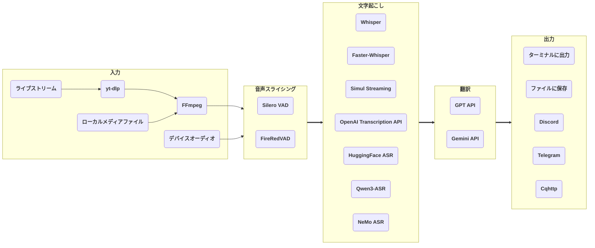

# stream-translator-gpt

[](./LICENSE) [](https://gradio.app)

[English](./README.md) | [中文](./README_CN.md) | 日本語

stream-translator-gpt は、ライブストリームのリアルタイム文字起こしと翻訳を行うコマンドラインツールです。より使いやすい WebUI エントリーポイントも追加されました。

このリポジトリは、元プロジェクト [ionic-bond/stream-translator-gpt](https://github.com/ionic-bond/stream-translator-gpt) の fork です。

Colab で試す：

|                                                                                     WebUI                                                                                     |                                                                                      コマンドライン                                                                                       |
| :---------------------------------------------------------------------------------------------------------------------------------------------------------------------------: | :---------------------------------------------------------------------------------------------------------------------------------------------------------------------------------------: |
| [](https://colab.research.google.com/github/W-Nana/stream-translator-gpt/blob/main/webui.ipynb) | [](https://colab.research.google.com/github/W-Nana/stream-translator-gpt/blob/main/stream_translator.ipynb) |

（API キーの頻繁なスクレイピングと盗用のため、試用の API キーを提供できません。ご自身の API キーをご記入ください。）

## パイプライン



[**yt-dlp**](https://github.com/yt-dlp/yt-dlp) を使用してライブストリームから音声データを抽出します。

動的しきい値による音声スライシングには、[**Silero-VAD**](https://github.com/snakers4/silero-vad) または OmniVAD 経由の **FireRedVAD** を使用できます。

ローカルで [**Whisper**](https://github.com/openai/whisper) / [**Faster-Whisper**](https://github.com/SYSTRAN/faster-whisper) / [**Simul Streaming**](https://github.com/ufal/SimulStreaming) / [**HuggingFace ASR**](https://huggingface.co/models?pipeline_tag=automatic-speech-recognition) / [**Qwen3-ASR**](https://github.com/QwenLM/Qwen3-ASR) / [**NeMo ASR**](https://docs.nvidia.com/nemo-framework/user-guide/latest/nemotoolkit/asr/intro.html) を使用するか、リモートで [**OpenAI Transcription API**](https://platform.openai.com/docs/guides/speech-to-text) を呼び出して文字起こしを行います。

OpenAI の [**GPT API**](https://platform.openai.com/docs/overview) / Google の [**Gemini API**](https://ai.google.dev/gemini-api/docs) を使用して翻訳を行います。

最後に、結果はターミナルに出力、ファイルに保存、またはソーシャルメディアボットを通じてグループに送信できます。

## プロジェクト構成

```text
.
├── stream_translator_gpt/        # Core CLI pipeline、ASR backend、VAD、翻訳、字幕共有
│   ├── assets/live_subtitles.html
│   └── simul_streaming/          # 同梱 SimulStreaming / Whisper streaming components
├── webui/                        # Gradio WebUI、デフォルト設定、多言語ファイル
│   ├── default.json
│   └── locales/
├── scripts/                      # デスクトップ/ソースツリー実行用のローカル uv 環境補助スクリプト
├── requirements*.txt             # optional dependency group 用の互換 requirements ファイル
├── stream_translator.ipynb       # Colab コマンドライン notebook
├── webui.ipynb                   # Colab WebUI notebook
├── pyproject.toml                # package metadata、uv dependencies/extras、console entry points
└── uv.lock                       # uv の lock file
```

生成されるローカル実行ディレクトリ `.venv`、`.cache`、`.local`、`.tmp`、`.config` は ignore 対象で、commit しないでください。

## 前提条件

1. **Python** >= 3.10
2. **FFmpeg**（既にインストール済みの場合はスキップ）：
   - Windows: `winget install ffmpeg`
   - Linux (Debian/Ubuntu): `sudo apt install ffmpeg`
3. [**システムに CUDA をインストール**](https://developer.nvidia.com/cuda-downloads)してください。
4. **Faster-Whisper** を使用する場合は、[**cuDNN を CUDA ディレクトリにインストール**](https://developer.nvidia.com/cudnn-downloads)してください。
5. [**Python に PyTorch（CUDA 版）をインストール**](https://pytorch.org/get-started/locally/)してください。
6. **Gemini API** で翻訳する場合は、[**Google API キーを作成**](https://aistudio.google.com/app/apikey)してください。
7. **OpenAI Transcription API** で文字起こし、または **GPT API** で翻訳する場合は、[**OpenAI API キーを作成**](https://platform.openai.com/api-keys)してください。

## インストール

### uv ローカルデプロイ

このリポジトリは、ソースチェックアウト上で `uv` と Python 3.12 を使って実行することを想定しています。

1. 任意: 仮想環境、uv キャッシュ、モデルのダウンロード、テンポラリファイルをプロジェクトディレクトリ内に置きます。

    ```bash
    source scripts/use-local-env.sh
    ```

2. uv で Python 3.12 をインストールし、基本環境を同期します。

    ```bash
    uv python install 3.12
    uv sync
    ```

3. 必要な機能に応じて `--extra` を追加します。複数の extra は自由に組み合わせられます。

    | Extra | 機能 |
    | :---- | :--- |
    | `webui` | Gradio WebUI |
    | `hf_asr` | HuggingFace ASR バックエンド |
    | `qwen_asr` | Qwen3-ASR バックエンドと BitsAndBytes 量子化サポート |
    | `nemo_asr` | NVIDIA NeMo ASR バックエンド、Parakeet を含む |
    | `firered_vad` | OmniVAD 経由の FireRedVAD |

    WebUI を含める例:

    ```bash
    uv sync --extra webui
    ```

    すべての extras をインストールする例:

    ```bash
    uv sync --extra webui --extra hf_asr --extra qwen_asr --extra nemo_asr --extra firered_vad
    ```

4. カスタム CUDA/PyTorch build が必要な場合は、先に `uv sync` を完了し、その後 [PyTorch installation guide](https://pytorch.org/get-started/locally/) に従って GPU/CUDA 環境に合う PyTorch build をインストールまたは置き換えてください。

    カスタム PyTorch を入れた後は、`uv run --no-sync ...` または `.venv/bin/...` を直接実行してください。後から依存関係を同期する場合は、現在の torch/triton/CUDA runtime パッケージを維持するために補助スクリプトを使えます。

    ```bash
    scripts/uv-sync-preserve-torch.sh --extra webui --extra nemo_asr
    ```

5. コマンドラインツールまたは WebUI を起動します。

    ```bash
    uv run --no-sync stream-translator-gpt {URL}
    uv run --no-sync stream-translator-gpt-webui
    ```

    `source scripts/use-local-env.sh` を実行済みの場合は、仮想環境が `PATH` に入るため、以下も利用できます。

    ```bash
    stream-translator-gpt {URL}
    stream-translator-gpt-webui
    ```

## 使い方

Colab 上のコマンド [](https://colab.research.google.com/github/W-Nana/stream-translator-gpt/blob/main/stream_translator.ipynb) が推奨される使い方です。以下はその他のよく使われるオプションです。

- ライブストリームの文字起こし（デフォルトで **Whisper** を使用）：

    ```stream-translator-gpt {URL} --language {入力言語}```

- **Faster-Whisper** で文字起こし：

    ```stream-translator-gpt {URL} --language {入力言語} --use_faster_whisper```

- **SimulStreaming** で文字起こし：

    ```stream-translator-gpt {URL} --language {入力言語} --use_simul_streaming```

- **Faster-Whisper** をエンコーダーとする **SimulStreaming** で文字起こし：

    ```stream-translator-gpt {URL} --language {入力言語} --use_simul_streaming --use_faster_whisper```

- **OpenAI Transcription API** で文字起こし：

    ```stream-translator-gpt {URL} --language {入力言語} --use_openai_transcription_api --openai_api_key {your_openai_key}```

- **HuggingFace ASR** モデルで文字起こし（`--extra hf_asr` で同期が必要）：

    ```stream-translator-gpt {URL} --model {hf_model_name} --use_hf_asr```

    Hugging Face Hub で `pipeline_tag` が `automatic-speech-recognition` のモデルのみサポートされています。

- **Qwen3-ASR** で文字起こし（`--extra qwen_asr` で同期が必要）：

    ```stream-translator-gpt {URL} --language {入力言語} --use_qwen3_asr --qwen3_asr_model Qwen/Qwen3-ASR-0.6B```

    `--language auto` を使うと、Qwen3-ASR が入力言語を自動検出します。Qwen3-ASR は upstream プロジェクトに記載されている 30 言語（例：`zh`、`en`、`ja`、`yue`、`fil`）をサポートしています。
    デフォルトの `--qwen3_asr_device_map auto` は、インストール済み PyTorch build が選択した CUDA GPU をサポートしている必要があります。合わない場合は互換性のある PyTorch build を入れるか、別の device map を明示してください。

- **NVIDIA Parakeet / NeMo ASR** で日本語を文字起こし（`--extra nemo_asr` で同期が必要）：

    ```stream-translator-gpt {URL} --language ja --use_nemo_asr --nemo_asr_model nvidia/parakeet-tdt_ctc-0.6b-ja```

    Parakeet は NeMo ベースの日本語 ASR モデルであり、Transformers pipeline モデルではありません。`--use_hf_asr` ではなく `--use_nemo_asr` を使用してください。TDT デコードがデフォルトで、fallback/debug 用に `--nemo_asr_decoding ctc` も利用できます。
    `--nemo_asr_device` が CUDA デバイスの場合、モデル読み込み時の一時的な VRAM ピークを抑えるため、checkpoint はまず CPU で復元され、その後 CUDA に移動されます。推論は選択した CUDA デバイス上で実行されます。

- **FireRedVAD** で音声スライシング（`--extra firered_vad` で同期が必要）：

    ```stream-translator-gpt {URL} --vad_backend firered```

    FireRedVAD は OmniVAD の CPU native runtime 経由で提供されます。`--firered_vad_model_path` を指定しない場合は、OmniVAD 同梱の FireRedVAD モデルを使用します。

### ASR モデルのプリロード

ローカル ASR を連続実行する場合は、`--preload_asr_model` を追加すると、タスク開始前に選択中の ASR バックエンドを読み込みます。さらに `--keep_asr_loaded` を追加すると、最初の URL 完了後もモデルを常駐させ、CLI が `Next URL>` を表示します。空行または `exit` でモデルをアンロードして終了します。

```bash
stream-translator-gpt {URL} --language ja --use_nemo_asr --preload_asr_model --keep_asr_loaded
```

CLI 常駐モードでは、タスク実行中に Ctrl+C を押すと現在のタスクだけを停止し、`Next URL>` に戻ります。プロンプト表示中に Ctrl+C を押すと終了してモデルをアンロードします。`--enable_subtitle_sharing` と `--keep_asr_loaded` を同時に使う場合、字幕共有サーバーは同じポートで常駐し、新しい URL ごとに新しい `task_id` が生成されます。

WebUI の Transcription タブでは、`Preload ASR Model` と `Unload ASR Model` を使用できます。現在の ASR 設定がプリロード済みモデルと一致する場合のみ再利用されます。backend/model/device/quantization など関連設定が変わった場合は、再度 preload するか unload するまで実行はブロックされます。OpenAI Transcription API はリモート API のためプリロード不要です。

- **Gemini** で他の言語に翻訳：

    ```stream-translator-gpt {URL} --language ja --translation_prompt "Translate from Japanese to English" --google_api_key {your_google_key}```

- **GPT** で他の言語に翻訳：

    ```stream-translator-gpt {URL} --language ja --translation_prompt "Translate from Japanese to English" --openai_api_key {your_openai_key}```

- **OpenAI Transcription API** と **Gemini** を同時に使用：

    ```stream-translator-gpt {URL} --language ja --use_openai_transcription_api --openai_api_key {your_openai_key} --translation_prompt "Translate from Japanese to English" --google_api_key {your_google_key}```

- ローカル動画/音声ファイルを入力として使用：

    ```stream-translator-gpt /path/to/file --language {入力言語}```

- システム音声を録音して入力：

    ```stream-translator-gpt device --language {入力言語}```

- マイクを録音して入力：

    ```stream-translator-gpt device --language {入力言語} --mic```

- 結果を Discord に送信：

    ```stream-translator-gpt {URL} --language {入力言語} --discord_webhook_url {your_discord_webhook_url}```

- 結果を Telegram に送信：

    ```stream-translator-gpt {URL} --language {入力言語} --telegram_token {your_telegram_token} --telegram_chat_id {your_telegram_chat_id}```

- 結果を Cqhttp に送信：

    ```stream-translator-gpt {URL} --language {入力言語} --cqhttp_url {your_cqhttp_url} --cqhttp_token {your_cqhttp_token}```

- 結果を .srt 字幕ファイルに保存：

    ```stream-translator-gpt {URL} --language ja --translation_prompt "Translate from Japanese to English" --google_api_key {your_google_key} --hide_transcribe_result --retry_if_translation_fails --output_timestamps --output_file_path ./result.srt```

### 字幕共有 API

WebUI の Output タブで `Enable Subtitle Sharing` を有効化し、公開字幕ポートを選択します。デフォルトは `8765` です。
コマンドライン実行では、`--enable_subtitle_sharing` を追加すると、CLI プロセスから同じ SSE 字幕共有サーバーを起動できます。

```bash
stream-translator-gpt {URL} --language {入力言語} --enable_subtitle_sharing --subtitle_share_host 0.0.0.0 --subtitle_share_public_port 8765
```

字幕共有サーバーには、`http://127.0.0.1:8765/` と `http://127.0.0.1:8765/live_subtitles.html` で開ける内蔵ライブ字幕ビューアもあります。

[W-Nana/SubtitleOverlay](https://github.com/W-Nana/SubtitleOverlay) と組み合わせて共有字幕を表示することもできます。本プロジェクト側で字幕共有を開始し、SubtitleOverlay の翻訳サーバー URL に公開字幕サーバーの URL を設定してください。同じマシンなら `http://127.0.0.1:8765`、LAN 内の別デバイスなら `http://192.168.1.100:8765` のような実際のホストアドレスを指定します。

外部クライアントは次の順序でライブ字幕ストリームを検出して利用できます。

1. WebUI サーバーまたは CLI の字幕共有ポートで `GET /api/server/info` を呼び、`public_host`、`public_port`、`enable_subtitle_sharing` を取得します。
2. 公開字幕ポートで `GET /api/translation/active-task` を呼び、現在の `task_id` を取得します。
3. 公開字幕ポートで `GET /api/translation/stream/{task_id}` を呼び、`text/event-stream` イベントを受信します。

SSE ストリームは `subtitle`、`status`、heartbeat comment、`error` イベントを送信します。字幕データには `timestamp`、`original`、`translated`、`asr_latency_ms`、`llm_latency_ms` が含まれます。翻訳が無効、またはその字幕で翻訳が実行されていない場合、`llm_latency_ms` は `null` です。

### すべてのオプション

| オプション                              | デフォルト値                   | 説明                                                                                                                                                                  |
| :-------------------------------------- | :----------------------------- | :-------------------------------------------------------------------------------------------------------------------------------------------------------------------- |
| **全般オプション**                      |
| `--openai_api_key`                      |                                | GPT 翻訳 / Whisper API を使用する場合に必要な OpenAI API キー。複数のキーがある場合は「,」で区切ると、各キーが順番に使用されます。                                    |
| `--google_api_key`                      |                                | Gemini 翻訳を使用する場合に必要な Google API キー。複数のキーがある場合は「,」で区切ると、各キーが順番に使用されます。                                                |
| `--openai_base_url`                     |                                | OpenAI の API エンドポイントをカスタマイズ（GPT 翻訳と OpenAI 文字起こしに影響）。                                                                                    |
| `--google_base_url`                     |                                | Google の API エンドポイントをカスタマイズ（Gemini 翻訳に影響）。                                                                                                     |
| `--proxy`                               |                                | 個別に設定されていないすべての --*_proxy の値を設定します。http_proxy 等の環境変数も設定します。                                                                      |
| **入力オプション**                      |                                |                                                                                                                                                                       |
| `URL`                                   |                                | ストリームの URL。ローカルファイルパスを入力すると、そのファイルが入力として使用されます。「device」と入力すると、PC デバイスから入力を取得します。                   |
| `--format`                              | ba/wa*                         | ストリーム形式コード。このパラメータは yt-dlp に直接渡されます。`yt-dlp {url} -F` で利用可能な形式コードの一覧を取得できます。                                        |
| `--list_format`                         |                                | 利用可能なすべての形式を表示して終了します。                                                                                                                          |
| `--cookies`                             |                                | メンバー限定ストリームを開くために使用します。このパラメータは yt-dlp に直接渡されます。                                                                              |
| `--input_proxy`                         |                                | yt-dlp 用の HTTP/HTTPS/SOCKS プロキシを指定します（例：http://127.0.0.1:7890）。                                                                                      |
| `--device_index`                        |                                | 録音するデバイスのインデックス。未設定の場合、システムデフォルトの録音デバイスが使用されます。                                                                        |
| `--list_devices`                        |                                | すべてのオーディオデバイス情報を表示して終了します。                                                                                                                  |
| `--device_recording_interval`           | 0.5                            | 録音間隔が短いほど遅延は低くなりますが、CPU 使用率が上がります。0.1〜1.0 の間に設定することを推奨します。                                                             |
| **音声スライシングオプション**          |                                |                                                                                                                                                                       |
| `--min_audio_length`                    | 0.5                            | 最小スライス音声長（秒）。                                                                                                                                            |
| `--max_audio_length`                    | 30.0                           | 最大スライス音声長（秒）。                                                                                                                                            |
| `--target_audio_length`                 | 5.0                            | 動的無音しきい値が有効な場合（デフォルトで有効）、プログラムはこの長さにできるだけ近づけて音声をスライスします。                                                      |
| `--continuous_no_speech_threshold`      | 1.0                            | この秒数の間に音声がない場合にスライスします。動的無音しきい値が有効な場合（デフォルトで有効）、実際のしきい値はこの値に基づいて動的に調整されます。                  |
| `--disable_dynamic_no_speech_threshold` |                                | このフラグを設定して動的無音しきい値を無効にします。                                                                                                                  |
| `--prefix_retention_length`             | 0.5                            | スライス時に保持するプレフィックス音声の長さ。                                                                                                                        |
| `--vad_backend`                         | silero                         | 音声スライシングに使う VAD バックエンド：silero または firered。FireRedVAD には `firered_vad` extra が必要です。                                                       |
| `--firered_vad_model_path`              |                                | 任意の OmniVAD FireRedVAD `.omnivad` モデルパス。省略すると OmniVAD 同梱モデルを使用します。                                                                           |
| `--vad_threshold`                       | 0.35                           | 範囲 0〜1。この値が高いほど、音声判定が厳しくなります。動的 VAD しきい値が有効な場合（デフォルトで有効）、入力音声の VAD 結果に基づいてしきい値が動的に調整されます。 |
| `--disable_dynamic_vad_threshold`       |                                | このフラグを設定して動的 VAD しきい値を無効にします。                                                                                                                 |
| **文字起こしオプション**                |                                |                                                                                                                                                                       |
| `--model`                               | small                          | Whisper/Faster-Whisper/Simul Streaming モデルサイズを選択。利用可能なモデルは[こちら](https://github.com/openai/whisper#available-models-and-languages)を参照。       |
| `--language`                            | auto                           | ストリームで話されている言語。利用可能な言語は[こちら](https://github.com/openai/whisper#available-models-and-languages)を参照。                                      |
| `--use_faster_whisper`                  |                                | Whisper の代わりに Faster-Whisper を使用します。--use_simul_streaming と併用すると、Faster-Whisper をエンコーダーとする SimulStreaming が使用されます。               |
| `--use_simul_streaming`                 |                                | Whisper の代わりに SimulStreaming を使用します。--use_faster_whisper と併用すると、Faster-Whisper をエンコーダーとする SimulStreaming が使用されます。                |
| `--use_openai_transcription_api`        |                                | ローカルの Whisper の代わりに OpenAI transcription API を使用します。                                                                                                 |
| `--use_hf_asr`                          |                                | HuggingFace ASR モデルを使用します。`--model` でモデル ID を指定します。`hf_asr` extra が必要です。                                                                       |
| `--use_qwen3_asr`                       |                                | Qwen3-ASR を使用します。`qwen_asr` extra が必要です。                                                                                                                  |
| `--qwen3_asr_model`                     | Qwen/Qwen3-ASR-0.6B            | Qwen3-ASR モデル名。例：Qwen/Qwen3-ASR-0.6B、Qwen/Qwen3-ASR-1.7B。                                                                                                     |
| `--qwen3_asr_dtype`                     | bfloat16                       | Qwen3-ASR 読み込み時の Torch dtype。例：bfloat16、float16、float32。                                                                                                  |
| `--qwen3_asr_device_map`                | auto                           | Qwen3-ASR 読み込み時の device map。例：auto、cuda:0、cpu。選択した CUDA デバイスは、インストール済み PyTorch build でサポートされている必要があります。               |
| `--qwen3_asr_max_new_tokens`            | 512                            | Qwen3-ASR の最大生成 token 数。                                                                                                                                        |
| `--qwen3_asr_quantization`              | none                           | Qwen3-ASR の量子化モード：none、bnb_8bit、bnb_4bit。`qwen_asr` extra の bitsandbytes が必要です。                                                                      |
| `--qwen3_asr_bnb_4bit_quant_type`       | nf4                            | Qwen3-ASR BitsAndBytes 4-bit 量子化タイプ：nf4 または fp4。                                                                                                          |
| `--qwen3_asr_bnb_4bit_use_double_quant` |                                | Qwen3-ASR 4-bit の nested/double quantization を有効にします。                                                                                                        |
| `--use_nemo_asr`                        |                                | NVIDIA NeMo ASR を使用します。`nemo_asr` extra が必要です。                                                                                                           |
| `--nemo_asr_model`                      | nvidia/parakeet-tdt_ctc-0.6b-ja | NeMo ASR モデル名。デフォルトの Parakeet モデルは日本語向けで、Transformers `--use_hf_asr` バックエンドではなく NeMo を使用します。                                  |
| `--nemo_asr_device`                     | auto                           | NeMo ASR 実行時のデバイス。例：auto、cuda:0、cuda:1、cpu、または PyTorch が受け付けるその他のデバイス文字列。                                                        |
| `--nemo_asr_decoding`                   | tdt                            | Hybrid NeMo ASR モデルのデコードモード：tdt または ctc。TDT はモデルのデフォルト decoder を維持し、短い近リアルタイム slice に推奨されます。                         |
| `--transcription_filters`               | emoji_filter,repetition_filter | 文字起こし結果に適用されるフィルター（「,」区切り）。emoji_filter、repetition_filter、japanese_stream_filter が利用可能です。                                         |
| `--transcription_initial_prompt`        |                                | 文字起こし用の汎用プロンプト/用語集。形式：「用語1, 用語2, ...」。このテキストは常にモデルに渡されるプロンプトに含まれます。                                          |
| `--disable_transcription_context`       |                                | 文字起こしにおけるコンテキスト（前の文）の伝播を無効にします。                                                                                                        |
| `--preload_asr_model`                   |                                | 実行前に選択中のローカル ASR バックエンドをプリロードします。OpenAI Transcription API はリモート API のためプリロード不要です。                                      |
| `--keep_asr_loaded`                     |                                | 各タスク完了後もプリロード済み ASR モデルを常駐させ、次の URL 入力を待ちます。`--preload_asr_model` が必要です。                                                       |
| **翻訳オプション**                      |
| `--gpt_model`                           | gpt-5.4-nano                   | OpenAI の GPT モデル名。gpt-5.4 / gpt-5.4-mini / gpt-5.4-nano / gpt-5.5                                                                                               |
| `--gemini_model`                        | gemini-3.1-flash-lite          | Google の Gemini モデル名。gemini-2.5-flash / gemini-2.5-flash-lite / gemini-3-flash-preview / gemini-3.1-flash-lite / gemini-3.5-flash                               |
| `--translation_prompt`                  |                                | 設定すると、GPT / Gemini API（入力された API キーに応じて決定）で結果テキストを対象言語に翻訳します。例：「Translate from Japanese to English」                       |
| `--translation_history_size`            | 0                              | LLM API 呼び出し時にコンテキストとして送信する以前の文字起こし数。弱いモデルではコンテキストを無効にする（0 に設定）ことを推奨します。                                |
| `--translation_timeout`                 | 10                             | GPT / Gemini の翻訳がこの秒数を超えた場合、その翻訳は破棄されます。                                                                                                   |
| `--use_json_result`                     |                                | 一部のローカルデプロイモデル向けに、LLM 翻訳で JSON 結果を使用します。                                                                                                |
| `--retry_if_translation_fails`          |                                | 翻訳がタイムアウト/失敗した場合にリトライします。オフラインで字幕を生成する際に使用します。                                                                           |
| `--temperature`                         |                                | GPT/Gemini パラメータ。出力のランダム性を制御し、値が高いほど多様な結果が生成されます。                                                                               |
| `--top_p`                               |                                | GPT/Gemini パラメータ。核サンプリングのしきい値。累積確率がこの値を超えるトークンのみが考慮されます。                                                                 |
| `--top_k`                               |                                | Gemini パラメータ。トークンの選択を確率が最も高い上位 K 個の候補に制限します。                                                                                        |
| `--prompt_cache_key`                    |                                | GPT パラメータ。設定すると、API 側のプロンプトキャッシュ最適化が有効になります。                                                                                      |
| `--reasoning_effort`                    |                                | GPT パラメータ。推論モデルの推論深度を制御します。オプション：none / minimal / low / medium / high / xhigh。                                                          |
| `--verbosity`                           |                                | GPT パラメータ。レスポンスの詳細度を制御します。オプション：auto / short / concise / detailed。                                                                       |
| `--service_tier`                        |                                | GPT パラメータ。処理の優先度を指定します。オプション：auto / default / flex / priority。                                                                              |
| `--debug_mode`                          |                                | デバッグモードを有効にします。LLM に送信されたメッセージと各翻訳呼び出し後の使用情報を表示します。                                                                    |
| `--processing_proxy`                    |                                | Whisper/GPT API 用の HTTP/HTTPS/SOCKS プロキシを指定します（Gemini は現在プログラム内でのプロキシ指定をサポートしていません）。例：http://127.0.0.1:7890。            |
| **出力オプション**                      |
| `--output_timestamps`                   |                                | テキスト出力時にタイムスタンプも出力します。                                                                                                                          |
| `--show_latency_log`                    |                                | ターミナルログに ASR と LLM の遅延をミリ秒で表示します。                                                                                                               |
| `--hide_transcribe_result`              |                                | Whisper の文字起こし結果を非表示にします。                                                                                                                            |
| `--output_file_path`                    |                                | 設定すると、結果テキストをこのパスに保存します。                                                                                                                      |
| `--cqhttp_url`                          |                                | 設定すると、結果テキストを cqhttp サーバーに送信します。                                                                                                              |
| `--cqhttp_token`                        |                                | cqhttp の Token。サーバー側で設定されていない場合は入力不要です。                                                                                                     |
| `--discord_webhook_url`                 |                                | 設定すると、結果テキストを Discord チャンネルに送信します。                                                                                                           |
| `--telegram_token`                      |                                | Telegram ボットの Token。                                                                                                                                             |
| `--telegram_chat_id`                    |                                | 設定すると、結果テキストをこの Telegram チャットに送信します。\"--telegram_token\" と併用する必要があります。                                                         |
| `--output_proxy`                        |                                | Cqhttp/Discord/Telegram 用の HTTP/HTTPS/SOCKS プロキシを指定します。例：http://127.0.0.1:7890。                                                                       |
| `--enable_subtitle_sharing`             |                                | CLI プロセスから公開 SSE 字幕共有サーバーを起動します。                                                                                                               |
| `--subtitle_share_host`                 | 0.0.0.0                        | 字幕共有サーバーを bind する Host/IP。0.0.0.0 を使うとすべてのネットワークインターフェイスで listen します。                                                          |
| `--subtitle_share_public_port`          | 8765                           | `--enable_subtitle_sharing` と組み合わせて使う公開字幕共有ポート。                                                                                                    |
